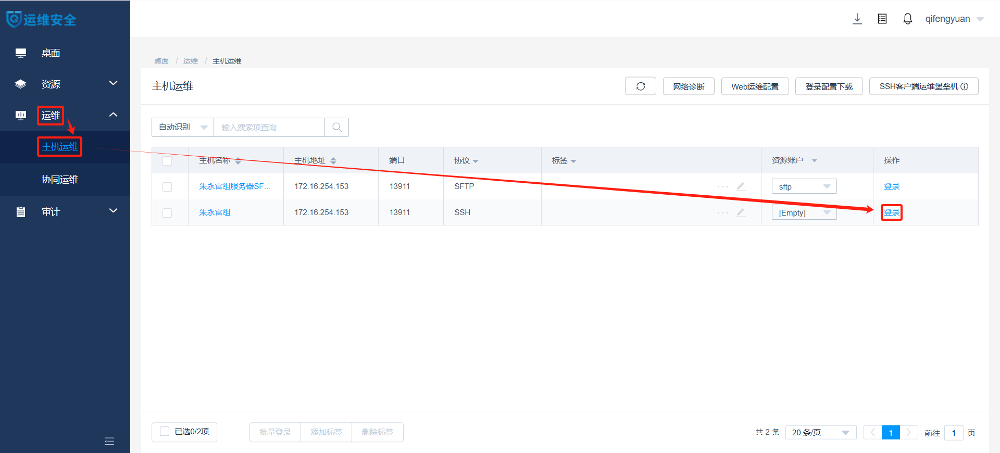
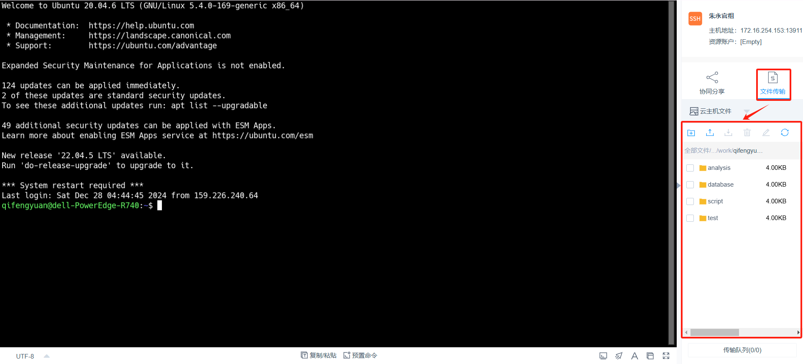
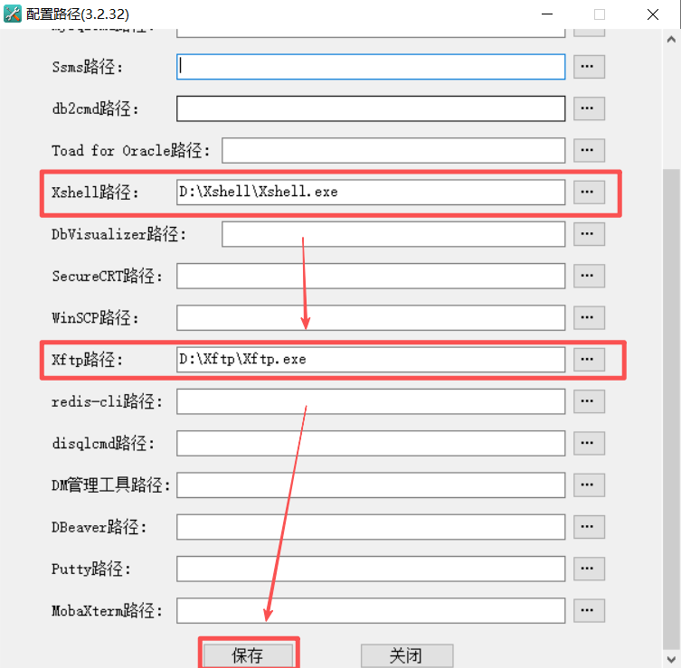
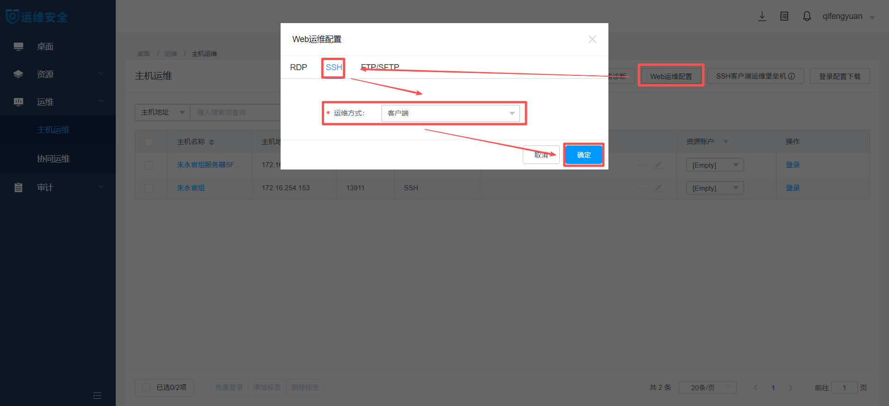
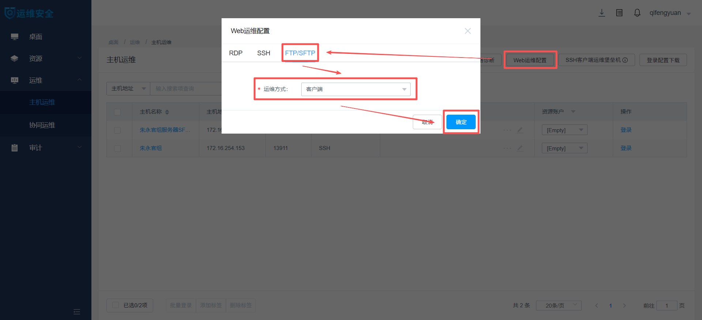
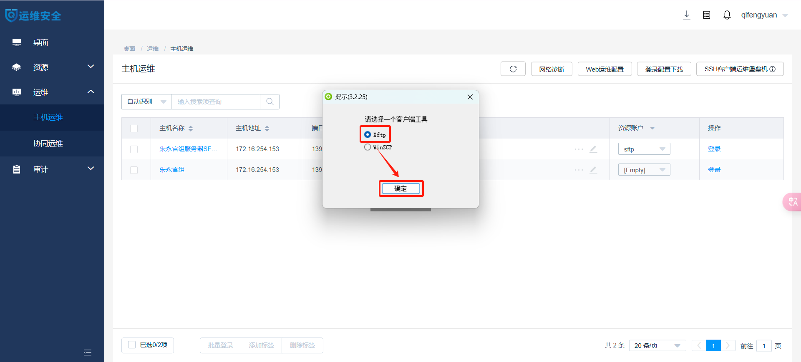
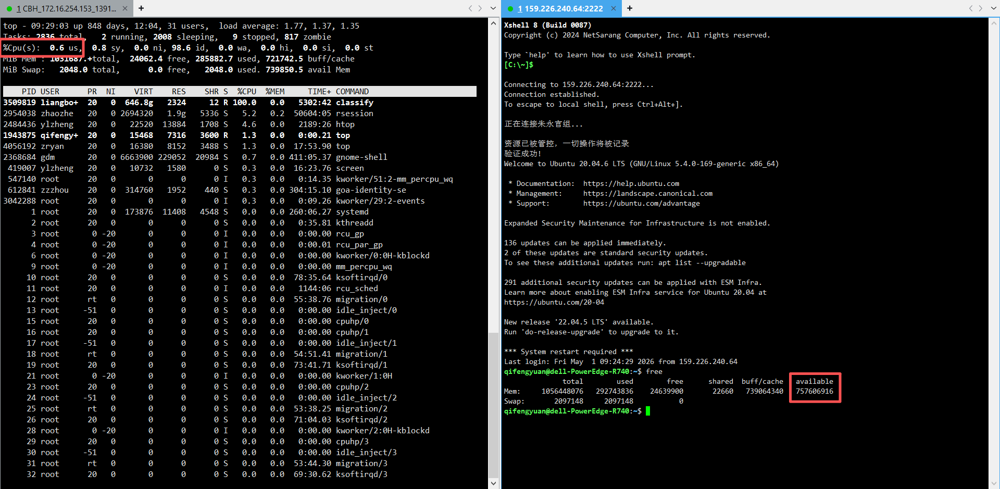
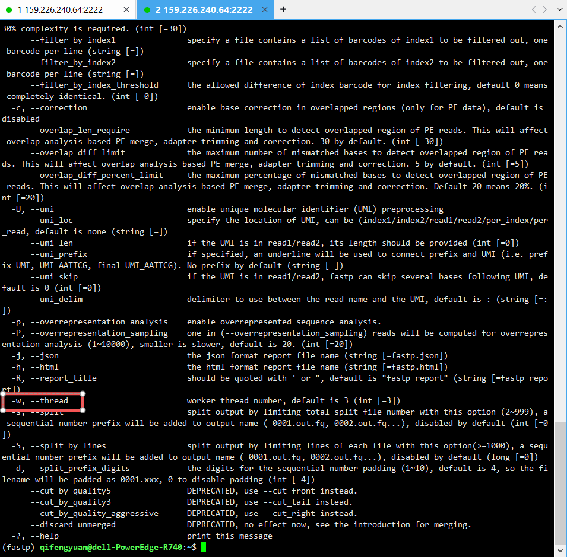

# 服务器使用指南
## 基本信息
### 存储空间
共有**3**个硬盘分区：`/database`（**32TB**）、`/database_new`（**10TB**）和`/data`（**15TB**）。
### 计算资源
共有**2**颗Intel Xeon Gold 6230处理器，每颗拥有**20**个物理CPU，总计提供**80**个逻辑CPU。内存共**1TB**。
## 操作流程
### 登录服务器
1. 使用**运维审计账号**登录[运维审计系统](https://159.226.240.64/#/login)。


2. 使用**服务器账号**登录服务器（SSH协议），进入命令行界面。注意区分**运维审计账号**与**服务器账号**，详见[注意事项](#注意事项)。




3. 在“文件传输”窗口进行数据的下载与上传。
   


### （可选）基于Xshell和Xftp登录服务器
1. 下载并安装SsoDBSettings。


2. 打开SsoDBSettings，将Xshell.exe和Xftp.exe的绝对路径写入指定位置。



3. 进入“Web运维配置”窗口，将“SSH”和“FTP/SFTP”的“运维方式”均设为“客户端”。




4. 使用**服务器账号**登录服务器（SSH协议），客户端工具选择“Xshell”，即可进入命令行界面。


5. 使用**服务器账号**登录服务器（SFTP协议），客户端工具选择“Xftp”，即可进入数据传输界面。
 


### 调用公共分析环境（以fastp为例）
1. 将miniconda3安装到**工作目录**。注意，miniconda3的默认安装位置为**主目录**而非**工作目录**（**主目录**与**工作目录**的区别详见[注意事项](#注意事项)），请在安装过程中进行手动修改。请点击[此处](https://blog.csdn.net/suiyueruge1314/article/details/126705416)查看本步骤的参考流程。

```
bash /database/public/software/Miniconda3-latest-Linux-x86_64.sh #若想下载最新版本请访问https://docs.anaconda.com/miniconda/
```

2. 调用[公共分析环境](#公共分析环境)。每个公共分析环境均以对应生信分析工具名称命名。

```
conda activate /database/public/software/miniconda3/envs/fastp #需输入公共分析环境的绝对路径
```

### （可选）调用自建分析环境（以fastp为例）
1. 为miniconda3添加国内镜像源。

```
conda config --add channels https://mirrors.tuna.tsinghua.edu.cn/anaconda/pkgs/free/
conda config --add channels https://mirrors.tuna.tsinghua.edu.cn/anaconda/pkgs/main/
conda config --add channels https://mirrors.tuna.tsinghua.edu.cn/anaconda/pkgs/r/
conda config --add channels https://mirrors.tuna.tsinghua.edu.cn/anaconda/pkgs/pro/
conda config --add channels https://mirrors.tuna.tsinghua.edu.cn/anaconda/pkgs/msys2/
conda config --add channels https://mirrors.tuna.tsinghua.edu.cn/anaconda/cloud/bioconda/
conda config --add channels https://mirrors.tuna.tsinghua.edu.cn/anaconda/cloud/conda-forge/
conda config --add channels https://mirrors.tuna.tsinghua.edu.cn/anaconda/cloud/qiime2
conda config --add channels https://mirrors.tuna.tsinghua.edu.cn/anaconda/cloud/biobakery
conda config --set show_channel_urls yes
```

2. 创建分析环境并安装相应分析工具。点击[此处](https://www.cnblogs.com/y593216/p/18665216)查看本步骤的参考教程。

```
conda create --name fastp #创建一个名为fastp的分析环境
conda activate fastp # 进入名为fastp的分析环境
conda install fastp # 安装名为fastp的分析软件
```

3. 调用自建分析环境。

```
conda activate fastp #仅需输入自建分析环境的名称
```

### 执行生信分析工作（以fastp为例）
1. 通过`top`命令查看空闲逻辑CPU数（下图为**79**）。通过`free`命令查看空闲内存（下图为***757GB**）。



3. 查看生信分析工具的帮助文档，确定**线程参数**与**内存参数**。

```
fastp -h #查看fastp的帮助文档
```



3. 在配置好**线程参数**与**内存参数**的情况下运行生信分析工具。**线程参数**不可大于空闲逻辑CPU数，**内存参数**不可大于空闲内存。若某生信分析工具的帮助文档中无**线程参数**或**内存参数**，则意味着该分析工具的线程或内存占用量极小，无需进行配置。

```
fastp \
  -i R1.fq \
  -I R2.fq \
  -o R1.clean.fq \
  -O R2.clean.fq \
  -w 70 \ #不可大于79
  -j fastp_report.json \
  -h fastp_report.html
```

## 公共资源
### 公共分析环境
|名称|路径|主页|
|---|---|---|
|ARGs-OAP v3.2.4|`/database/public/software/miniconda3/envs/argsoap`|https://github.com/xinehc/args_oap|
|Bowtie v2.5.4|`/database/public/software/miniconda3/envs/bowtie`|https://github.com/BenLangmead/bowtie2|
|BWA v0.7.18|`/database/public/software/miniconda3/envs/bwa`|https://github.com/lh3/bwa|
|CRISPRCasTyper v1.18.0|`/database/public/software/miniconda3/envs/cctyper`|https://github.com/Russel88/CRISPRCasTyper|
|CheckM2 v1.0.1|`/database/public/software/miniconda3/envs/checkm`|https://github.com/chklovski/CheckM2|
|DIAMOND v0.9.24|`/database/public/software/miniconda3/envs/diamond`|https://github.com/bbuchfink/diamond|
|eggNOG-mapper v2.1.12|`/database/public/software/miniconda3/envs/eggnogmapper`|https://github.com/eggnogdb/eggnog-mapper|
|fastp v0.24.0|`/database/public/software/miniconda3/envs/fastp`|https://github.com/OpenGene/fastp|
|GRiD v1.3|`/database/public/software/miniconda3/envs/grid`|https://github.com/ohlab/GRiD|
|inStrain v1.7.6|`/database/public/software/miniconda3/envs/instrain`|https://github.com/MrOlm/inStrain|
|KneadData v0.12.0|`/database/public/software/miniconda3/envs/kneaddata`|https://github.com/biobakery/kneaddata|
|KofamScan v1.3.0|`/database/public/software/miniconda3/envs/kofamscan`|https://github.com/takaram/kofam_scan|
|Kraken v2.1.3|`/database/public/software/miniconda3/envs/kraken`|https://github.com/DerrickWood/kraken2|
|MEGAHIT v1.2.9|`/database/public/software/miniconda3/envs/megahit`|https://github.com/voutcn/megahit|
|MetaCHIP v1.10.4|`/database/public/software/miniconda3/envs/metachip`|https://github.com/songweizhi/MetaCHIP|
|minimap v2.28|`/database/public/software/miniconda3/envs/minimap`|https://github.com/lh3/minimap2|
|MMseqs2 v15.6f452|`/database/public/software/miniconda3/envs/mmseqs`|https://github.com/soedinglab/MMseqs2|
|MOB-suite v3.1.7|`/database/public/software/miniconda3/envs/mobsuite`|https://github.com/phac-nml/mob-suite|
|PhiSpy v4.2.21|`/database/public/software/miniconda3/envs/phispy`|https://github.com/linsalrob/PhiSpy|
|QIIME2 v2024.2.0|`/database/public/software/miniconda3/envs/qiime`|https://github.com/qiime2/qiime2|
|Salmon v1.10.3|`/database/public/software/miniconda3/envs/salmon`|https://github.com/COMBINE-lab/salmon|
|samtools v1.21|`/database/public/software/miniconda3/envs/samtools`|https://github.com/samtools/samtools|
|SemiBin v2.1.0|`/database/public/software/miniconda3/envs/semibin`|https://github.com/BigDataBiology/SemiBin|
|SPAdes v4.0.0|`/database/public/software/miniconda3/envs/spades`|https://github.com/ablab/spades|
|Trimmomatic v0.39|`/database/public/software/miniconda3/envs/trimmomatic`|https://github.com/timflutre/trimmomatic|
### 数据库
|名称|路径|文献|
|---|---|---|
|CARD|`/database/public/database/card`|https://card.mcmaster.ca/home|
|GRiD|`/database/public/database/grid`|https://github.com/ohlab/GRiD|
|KofamScan|`/database/public/database/kofamscan`|https://www.genome.jp/tools/kofamkoala|
|Kraken|`/database/public/database/kraken`|https://benlangmead.github.io/aws-indexes/k2|
|SARG|`/database/public/database/sarg`|https://smile.hku.hk/ARGs/Indexing/download|
|NCycDB|`/database/public/database/ncycdb`|https://github.com/qichao1984/NCyc|
|PCycDB|`/database/public/database/pcycdb`|https://github.com/ZengJiaxiong/Phosphorus-cycling-database|
|SCycDB|`/database/public/database/scycdb`|https://github.com/qichao1984/SCycDB|

## 注意事项
- 正确区分**运维审计账号**与**服务器账号**。**运维审计账号**是“服务器运维系统申请表”中“运维审计账号”栏内容，用于登录[运维审计系统](https://159.226.240.64/#/login)；**服务器账号**是服务器管理员分配给每位用户的，用于在[运维审计系统](https://159.226.240.64/#/login)内访问服务器的账号。
- 正确区分**工作目录**与**主目录**。**工作目录**由服务器管理员分配给每位用户，用户仅能在自己的**工作目录**下进行生信分析工作；**主目录**仅用于存储配置文件（可使用`echo $HOME`命令查看其路径），用户在**主目录**下仅能进行配置文件的创建与修改。
