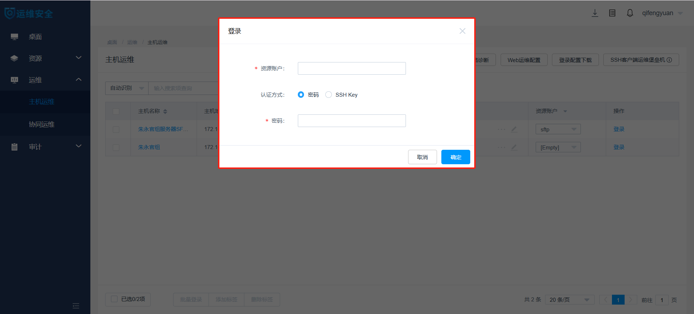
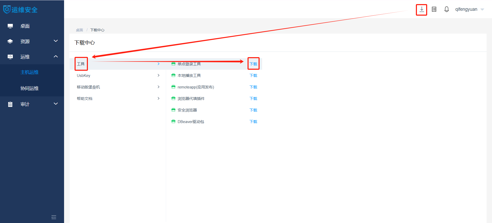
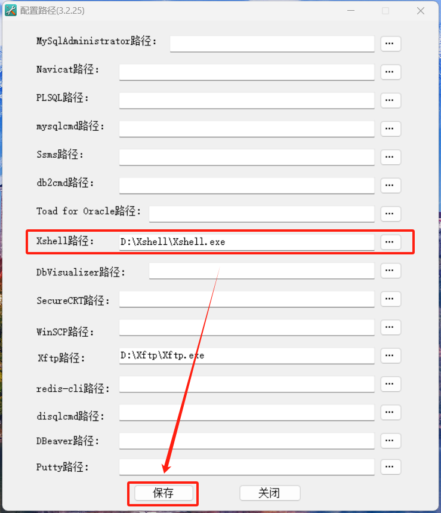
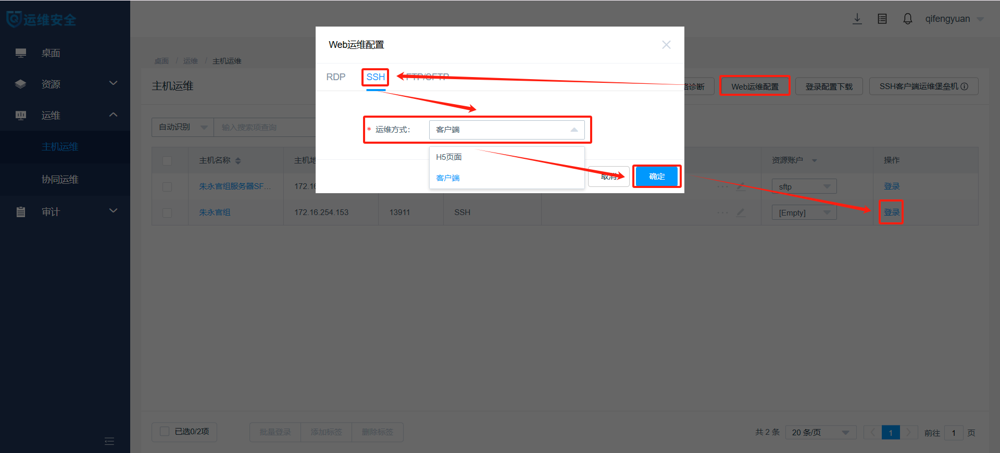
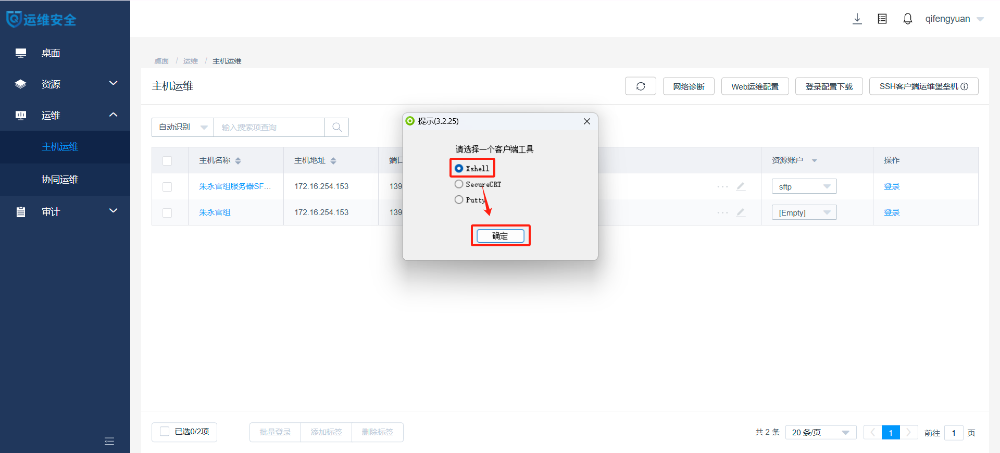

# 服务器使用指南
## 基本信息
### 存储空间
共有3个存储卷：/dev/sdc（**32TB**）、/dev/sda1（**10TB**）和/dev/sdm1（**15TB**），分别挂载于`/database`、`/database_new`和`/data`。
### 计算资源
配备了两颗Intel Xeon Gold 6230处理器，每颗拥有20个物理核心，总计提供**80**个逻辑CPU。物理内存共**1TB**。
## 操作流程
### 登录服务器
1. 使用**运维审计账号**登录[运维审计系统](https://159.226.240.64/#/login)。


2. 登录协议为“SSH”的主机。


3. 使用**服务器账号**登录服务器，进入命令行界面。注意区分**运维审计账号**与**服务器账号**，详见[注意事项](#注意事项)。



4. 在“文件传输”板块进行数据的下载与上传。


### （可选）在Xshell和Xftp中登录服务器
1. 下载并安装SsoDBSettings。



2. 打开SsoDBSettings，将Xshell.exe和Xftp.exe的绝对路径写入指定位置后保存。



3. 进入在“主机运维”页面的“Web运维配置”板块，将“SSH”和“FTP/SFTP”的“运维方式”均设为“客户端”。




4. 登录协议为“SSH”的主机，选择“Xshell”，即可进入命令行界面。


4. 登录协议为“SFTP”的主机，选择“Xftp”，即可进入数据传输界面。


### 配置分析环境
1. 将miniconda3安装到**工作目录**。注意，miniconda3的默认安装位置为**主目录**而非**工作目录**（**主目录**与**工作目录**的区别详见[注意事项](#注意事项)），请在安装过程中进行手动修改。请点击[此处](https://blog.csdn.net/suiyueruge1314/article/details/126705416)查看本步骤的参考流程。
```
bash /database/public/software/Miniconda3-latest-Linux-x86_64.sh #若想下载最新版本请访问https://docs.anaconda.com/miniconda/
```
2. 在miniconda3中配置国内镜像源。
```
conda config --add channels https://mirrors.tuna.tsinghua.edu.cn/anaconda/pkgs/free/
conda config --add channels https://mirrors.tuna.tsinghua.edu.cn/anaconda/pkgs/main/
conda config --add channels https://mirrors.tuna.tsinghua.edu.cn/anaconda/pkgs/r/
conda config --add channels https://mirrors.tuna.tsinghua.edu.cn/anaconda/pkgs/pro/
conda config --add channels https://mirrors.tuna.tsinghua.edu.cn/anaconda/pkgs/msys2/
conda config --add channels https://mirrors.tuna.tsinghua.edu.cn/anaconda/cloud/bioconda/
conda config --add channels https://mirrors.tuna.tsinghua.edu.cn/anaconda/cloud/conda-forge/
conda config --add channels https://mirrors.tuna.tsinghua.edu.cn/anaconda/cloud/qiime2
conda config --add channels https://mirrors.tuna.tsinghua.edu.cn/anaconda/cloud/biobakery
conda config --set show_channel_urls yes
```
3. （可选）创建生信分析环境并安装相应分析软件。点击[此处](https://www.cnblogs.com/y593216/p/18665216)查看本步骤参考教程。
```
conda create --name fastp #创建一个名为fastp的分析环境
conda activate fastp # 进入名为fastp的分析环境
conda install fastp # 安装名为fastp的分析软件
```
4. 调用自建或[公共分析环境](#分析环境)。注意，请在调用公共分析环境时使用绝对路径。
```
conda activate fastp #调用自建分析环境
conda activate /database/public/software/miniconda3/envs/fastp #调用公共分析环境
```
## 注意事项
- 正确区分**运维审计账号**与**服务器账号**。**运维审计账号**是“服务器运维系统申请表”中“运维审计账号”栏中内容，用于登录运维审计系统；**服务器账号**是管理员分配给每位用户的，用于在运维审计系统内访问服务器的账号。
- 正确区分**工作目录**与**主目录**。**工作目录**是管理员分配给每位用户的专属目录，用户可点击[此处](table/用户名录.CSV)查看；**主目录**是用于存储用户配置文件的目录，可使用命令`echo $HOME`查看。受限于服务器的存储空间分配，用户仅能在**工作目录**下进行包括**配置分析环境**在内的所有生物信息分析工作，仅能在**主目录**下进行用户配置文件的修改。
- 通过Xftp访问服务器文件目录的是用户名为sftp的公共**服务器账号**，该账号与所有服务器用户共属于community组。因此，通过Xftp进行文件的下载时需关注被下载文件的权限设置能否被同组的其他用户读取。此外，请不要在Xftp客户端内进行任何除了数据传输之外的操作（特别是文件夹的创建），这会导致新建文件夹的用户权限错误。请点击[此处](https://www.runoob.com/linux/linux-file-attr-permission.html)查看关于文件权限设置的说明文档。
## 公共资源
### 分析环境
|名称|路径|主页|
|---|---|---|
|ARGs-OAP v3.2.4|`/database/public/software/miniconda3/envs/argsoap`|https://github.com/xinehc/args_oap|
|Bowtie v2.5.4|`/database/public/software/miniconda3/envs/bowtie`|https://github.com/BenLangmead/bowtie2|
|BWA v0.7.18|`/database/public/software/miniconda3/envs/bwa`|https://github.com/lh3/bwa|
|CRISPRCasTyper v1.18.0|`/database/public/software/miniconda3/envs/cctyper`|https://github.com/Russel88/CRISPRCasTyper|
|CheckM2 v1.0.1|`/database/public/software/miniconda3/envs/checkm`|https://github.com/chklovski/CheckM2|
|DIAMOND v0.9.24|`/database/public/software/miniconda3/envs/diamond`|https://github.com/bbuchfink/diamond|
|eggNOG-mapper v2.1.12|`/database/public/software/miniconda3/envs/eggnogmapper`|https://github.com/eggnogdb/eggnog-mapper|
|fastp v0.24.0|`/database/public/software/miniconda3/envs/fastp`|https://github.com/OpenGene/fastp|
|GRiD v1.3|`/database/public/software/miniconda3/envs/grid`|https://github.com/ohlab/GRiD|
|inStrain v1.7.6|`/database/public/software/miniconda3/envs/instrain`|https://github.com/MrOlm/inStrain|
|KneadData v0.12.0|`/database/public/software/miniconda3/envs/kneaddata`|https://github.com/biobakery/kneaddata|
|KofamScan v1.3.0|`/database/public/software/miniconda3/envs/kofamscan`|https://github.com/takaram/kofam_scan|
|Kraken v2.1.3|`/database/public/software/miniconda3/envs/kraken`|https://github.com/DerrickWood/kraken2|
|MEGAHIT v1.2.9|`/database/public/software/miniconda3/envs/megahit`|https://github.com/voutcn/megahit|
|MetaCHIP v1.10.4|`/database/public/software/miniconda3/envs/metachip`|https://github.com/songweizhi/MetaCHIP|
|minimap v2.28|`/database/public/software/miniconda3/envs/minimap`|https://github.com/lh3/minimap2|
|MMseqs2 v15.6f452|`/database/public/software/miniconda3/envs/mmseqs`|https://github.com/soedinglab/MMseqs2|
|MOB-suite v3.1.7|`/database/public/software/miniconda3/envs/mobsuite`|https://github.com/phac-nml/mob-suite|
|PhiSpy v4.2.21|`/database/public/software/miniconda3/envs/phispy`|https://github.com/linsalrob/PhiSpy|
|QIIME2 v2024.2.0|`/database/public/software/miniconda3/envs/qiime`|https://github.com/qiime2/qiime2|
|Salmon v1.10.3|`/database/public/software/miniconda3/envs/salmon`|https://github.com/COMBINE-lab/salmon|
|samtools v1.21|`/database/public/software/miniconda3/envs/samtools`|https://github.com/samtools/samtools|
|SemiBin v2.1.0|`/database/public/software/miniconda3/envs/semibin`|https://github.com/BigDataBiology/SemiBin|
|SPAdes v4.0.0|`/database/public/software/miniconda3/envs/spades`|https://github.com/ablab/spades|
|Trimmomatic v0.39|`/database/public/software/miniconda3/envs/trimmomatic`|https://github.com/timflutre/trimmomatic|
### 数据库
|名称|路径|文献|
|---|---|---|
|CARD|`/database/public/database/card`|https://card.mcmaster.ca/home|
|GRiD|`/database/public/database/grid`|https://github.com/ohlab/GRiD|
|KofamScan|`/database/public/database/kofamscan`|https://www.genome.jp/tools/kofamkoala|
|Kraken|`/database/public/database/kraken`|https://benlangmead.github.io/aws-indexes/k2|
|SARG|`/database/public/database/sarg`|https://smile.hku.hk/ARGs/Indexing/download|
|NCycDB|`/database/public/database/ncycdb`|https://github.com/qichao1984/NCyc|
|PCycDB|`/database/public/database/pcycdb`|https://github.com/ZengJiaxiong/Phosphorus-cycling-database|
|SCycDB|`/database/public/database/scycdb`|https://github.com/qichao1984/SCycDB|

